# Invoice Terminal App – T1A3

Welcome to my Invoice App, a terminal-based application designed to generate and manage invoices. This application is built with Python.

In the app you can:

- **Create new invoices**: The application guides you through the process of creating a new invoice, asking for customer details, invoice number, due date, and items to be invoiced. It then generates a professional-looking HTML invoice, converts it to a PDF.

- **View past invoices**: The app keeps a record of all past invoices. You can view this list anytime and choose to re-export any invoice to a PDF or delete an invoice record.

- **Manage your company profile**: The application allows you to view and update your company profile. This information is used when generating invoices.

The app is designed to be easy to install and use, with automatic installation of dependencies and a clear, intuitive user interface.

You can view the [GitHub repository here](https://github.com/damian-dp/T1A3-Invoice_Terminal_App).

<br>

## Installation

### Unix-based Systems (macOS, Linux)

1. Open a terminal. You must use a standalone terminal window that can be resized. Do not use inbuilt VS Code terminal.

2. Clone the GitHub repository via SSH:
    ```sh
    git clone git@github.com:damian-dp/T1A3-Invoice_Terminal_App.git
    ```
    or via HTTPS:

    ```sh
    git clone https://github.com/damian-dp/T1A3-Invoice_Terminal_App.git
    ```

<br>

3. Navigate to the `/src` directory in the cloned repository:
    ```sh
    cd T1A3-Invoice_Terminal_App/src
    ```

<br>

4. Add execute permissions to the run_app.sh script:
    ```sh
    chmod +x run_app.sh
    ```
    Note: copying this command and then pasting it into your terminal to run may throw an error: command doesnt exist. You may need to type it out manually.

<br>

5. Run the run_app.sh script to start the application:
    ```sh
    ./run_app.sh
    ```

<br>

### Windows
1. Install [Windows Subsystem for Linux (WSL)](https://learn.microsoft.com/en-us/windows/wsl/install).

2. Open a WSL terminal. You must use a standalone WSL terminal window that can be resized. Do not use inbuilt VS Code terminal.

3. Clone the GitHub repository via SSH:
    ```sh
    git clone git@github.com:damian-dp/T1A3-Invoice_Terminal_App.git
    ```
    or via HTTPS:

    ```sh
    git clone https://github.com/damian-dp/T1A3-Invoice_Terminal_App.git
    ```

<br>

4. Navigate to the `/src` directory in the cloned repository:
    ```sh
    cd T1A3-Invoice_Terminal_App/src
    ```

<br>

5. Add execute permissions to the run_app.sh script:
    ```sh
    chmod +x run_app.sh
    ```
    Note: copying this command and then pasting it into your terminal to run may throw an error: command doesnt exist. You may need to type it out manually.

<br>

6. Run the run_app.sh script to start the application:
    ```sh
    ./run_app.sh
    ```

<br>

## Prerequisites

- Python 3
- Bash (pre-installed on Unix-based systems, available on Windows via WSL)
- Git

<br>

## Dependencies

This application uses the following Python libraries:

- [`jinja2`](https://jinja.palletsprojects.com/): A modern and designer-friendly templating language for Python. It is used in this application to generate HTML invoices from a template.

- [`xhtml2pdf`](https://xhtml2pdf.readthedocs.io/): A library for converting HTML content into PDFs. In this application, it is used to convert the HTML invoices generated by `jinja2` into PDFs.

- [`colored`](https://pypi.org/project/colored/): A library for coloring terminal text. It is used in this application to apply colors and styles to the text in the terminal-based user interface.

- [`pyfiglet`](https://pypi.org/project/pyfiglet/): A Python port of FIGlet, a program that generates text banners in various typefaces composed of letters made up of conglomerations of smaller ASCII characters. It is used in this application to generate ASCII art text for headers in the terminal-based user interface.

These dependencies are automatically installed when you run the `run_app.sh` script.

<br>

## Usage

After running the `run_app.sh` script for the first time you will be presented with a welcome screen that acts as an onbaording process. This process captures and saves details that are used to populate the company info sections on generated invoices. The onbaording process will not run again the next time you start the app. You can update these details any time via the main menu.

After completing the onbaording process you will be presented with a main menu of options:

1. **Create a new invoice**: If you select this option by entering '1', you will be guided through the process of creating a new invoice. You will be asked to enter the customer's details, the invoice number, the due date, and the items to be invoiced. Once you have entered all the required information, the application will generate an HTML invoice, convert it to a PDF, and save the invoice information to a CSV file. The PDF invoice will be saved in the `src/Invoice Exports` directory, if the directory does not exist it will create it. The invoice information will also be appended to the `past_invoices.csv` file in the `src/data` directory for viewing and re-exporting via the main menu.

2. **View past invoices**: If you select this option by entering '2', the application will display a list of past invoices. You can choose to re-export an invoice to a PDF or delete an invoice record. If you choose to re-export an invoice, the application will generate a new PDF invoice and save it in the `src/Invoice Exports` directory.

3. **View and update company profile**: If you select this option by entering '3', the application will display your company profile. You can choose to update the company profile. If you choose to update the company profile, the application will guide you through the process of entering the new company details. The updated company profile will be saved to the `company_profile.csv` file in the `src/data` directory.

4. **Exit the application**: If you select this option by entering '4', the application will exit.

Please note that you need to enter the number of the option you want to select. If you enter an invalid choice, the application will display a message and prompt you to enter a valid choice.

<br>

## Features

This application includes the following features:

- **Company Onboarding**: When you run the application for the first time, it will guide you through an onboarding process where you can enter your company's details. These details are used when generating invoices. This is facilitated by the `onboarding()` function. Additionally, at the start of every launch, the `check_onboarding()` function is used to check if onboarding has been completed before by looking for a `company_profile.csv` file. If the file exists, it means onboarding has been completed; if not, the onboarding process is initiated.

- **Invoice Creation**: The application allows you to create new invoices. You can enter the customer's details, the invoice number, the due date, and the items to be invoiced. The application generates an HTML invoice using the `jinja2` library, converts the HTML invoice to a PDF using the `xhtml2pdf` library, and saves the invoice information to a CSV file. This is done by the `create_new_invoice()` function.

- **Invoice Viewing and Re-Export**: The application allows you to view past invoices. It reads the past invoices from a CSV file and displays them to you. You can choose to re-export an invoice to a PDF or delete an invoice record. This is handled by the `view_past_invoices()` function.

- **Company Profile Viewing and Updating**: The application allows you to view and update your company profile that was created during the company onboarding process. It reads the company profile from a CSV file and displays it to you. You can choose to update the company profile. This is managed by the `view_and_update_company_profile()` function.

- **User-Friendly Interface**: The application provides a user-friendly, text-based interface. The [`ui_screens.py`](src/app/utils/ui_screens.py) file uses the `colored` and `pyfiglet` libraries to create visually appealing screens. The `colored` library is used to apply colors and styles to the text, while the `pyfiglet` library is used to generate ASCII art text for headers. The `centre_align_text`, `right_align_text`, and `mixed_align_text` functions are used to align text within the terminal window, ensuring that the layout of the screens is consistent regardless of the terminal window size.

- **Bash Scripts**: The application uses several Bash scripts to manage the application environment.

    - The `run_app.sh` script resizes the terminal window and then makes `check_python.sh` executable and runs it.

    - The  `check_python.sh` script checks if Python 3 is installed and if the Python version is 3.8 or above. If it failes either check the user prompted to install or update Python. If it passes all checks it then makes `install_dependencies.sh` executable and runs it.
    
    - The `install_dependencies.sh` script first removes any existing virtual environments. It then creates a new venv and activates it. The script then installs the Python dependencies required by the application. Finally it then runs the Python app `app.py`. 
    
    - The `shut_down.sh` script is run by the Python app `app.py` when the user selects to exit the app from the main menu. This script deactivates the virtual environment and deletes it. It then thanks the user for using the app!

<br>

## Code Style Guide

This project adheres to the [PEP 8](https://pep8.org/) style guide for Python code. PEP 8 is a set of recommendations for how to format Python code to improve its readability and consistency. It covers topics such as indentation, variable naming, and line length.

<br>

## Code Logic

Below you will find a logic flowchart and a detailed pseudocode outline of my app. Both were created before developing my implementation plan or begining to code.

#### Pseudocode:
- [App Pseudocode File](docs/app_pseudocode.txt)


#### Logic Flowchart:

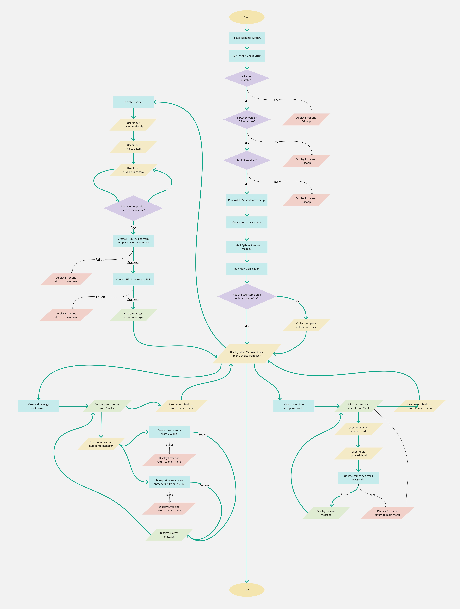

<br>


## Implementation Plan

The implementation plan can be [viewed on trello](https://trello.com/b/X0NxIwvu). You can also find screenshots of the working trello baord below:

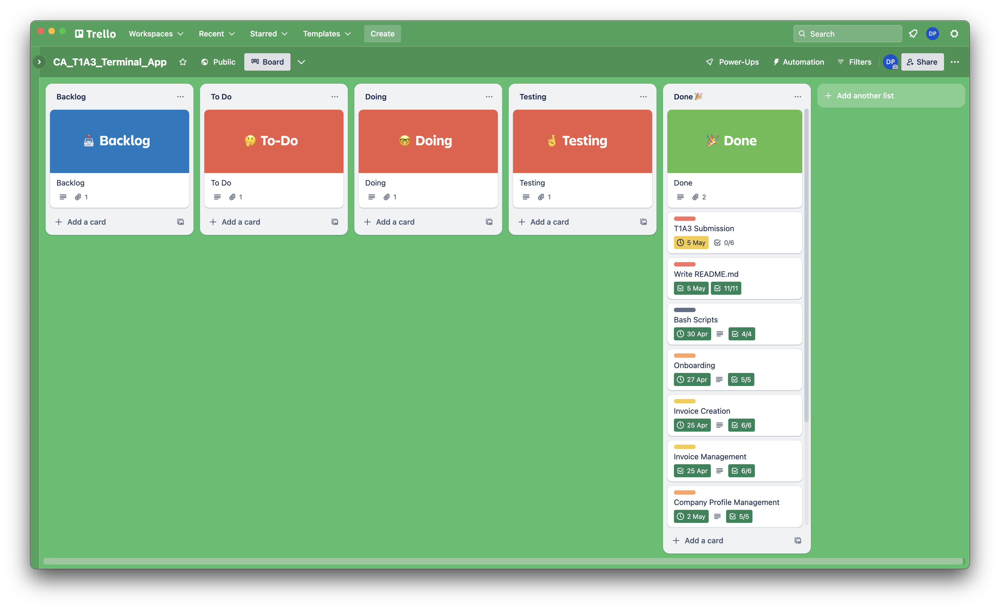
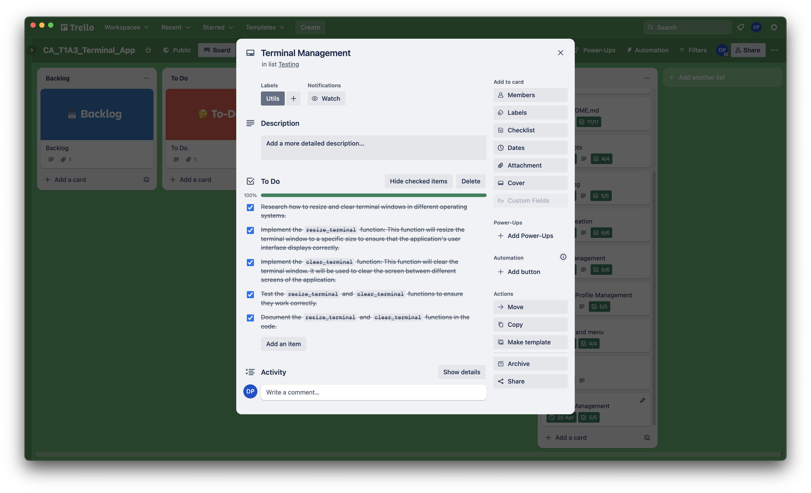
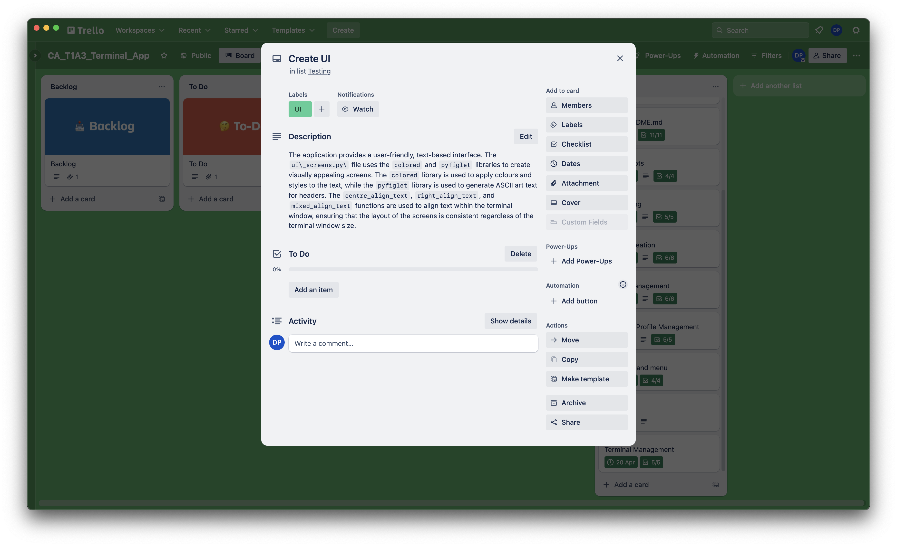
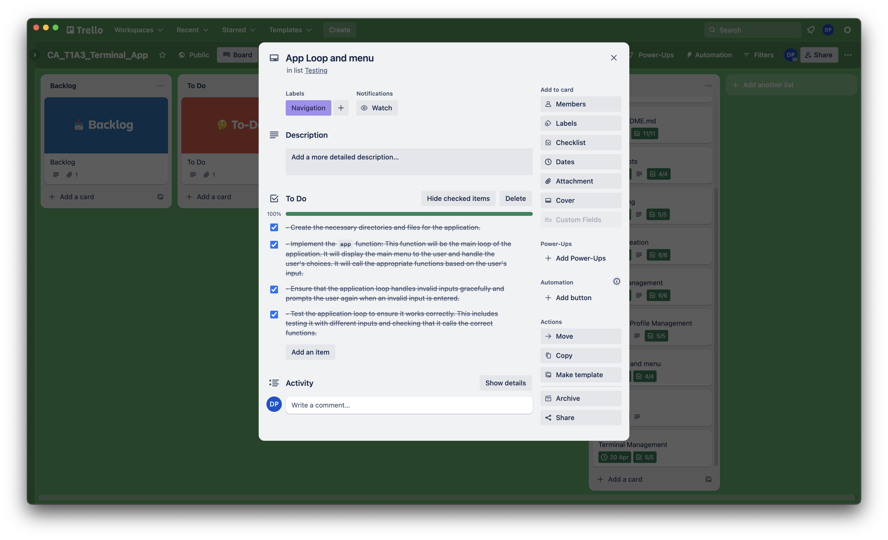
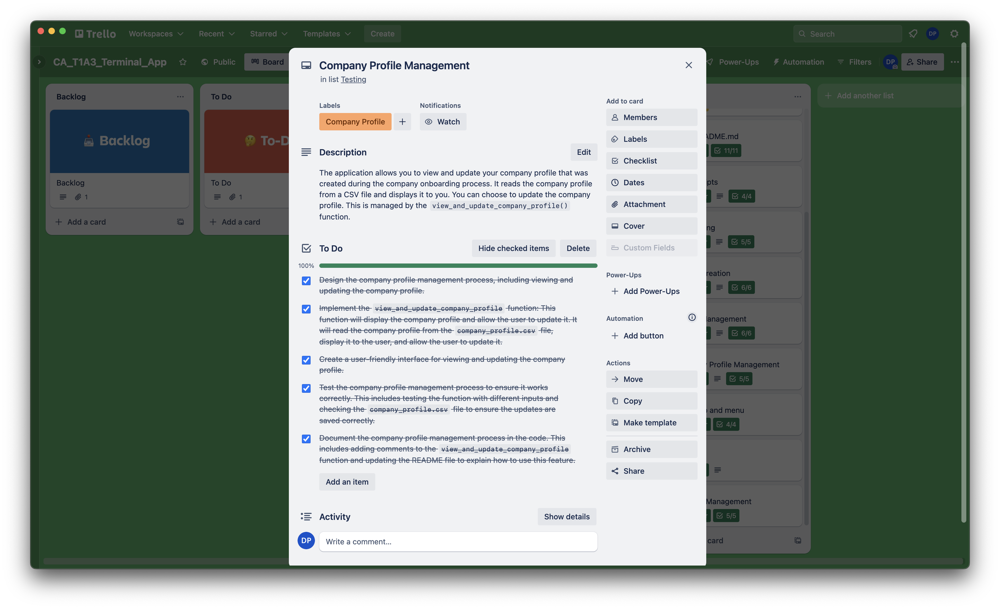
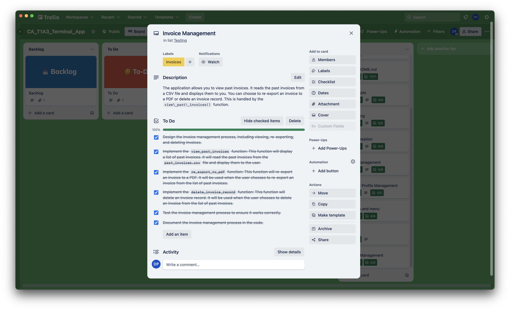
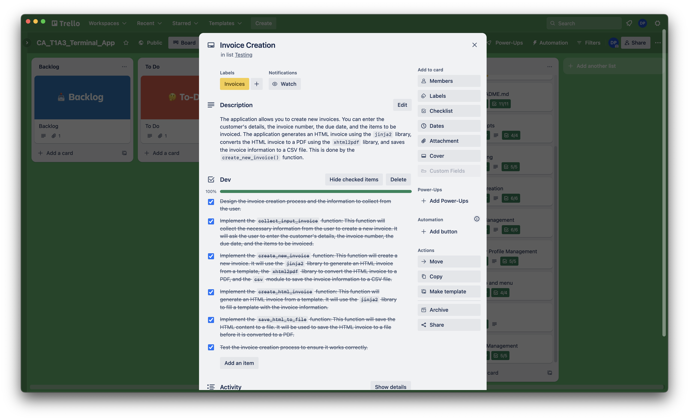
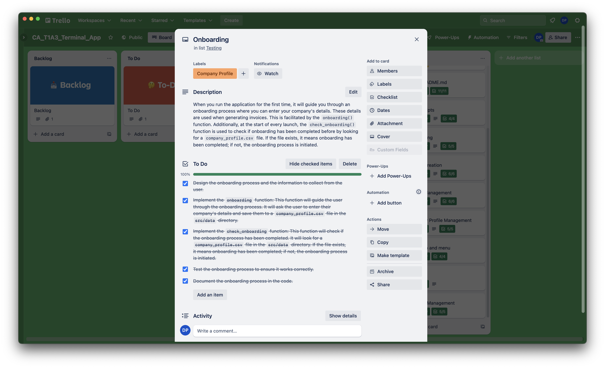
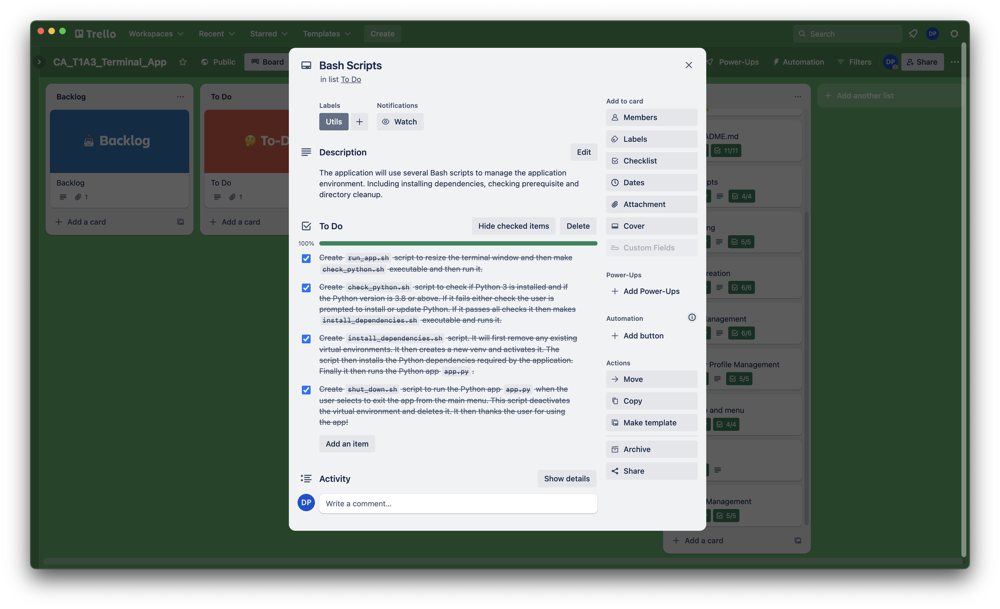
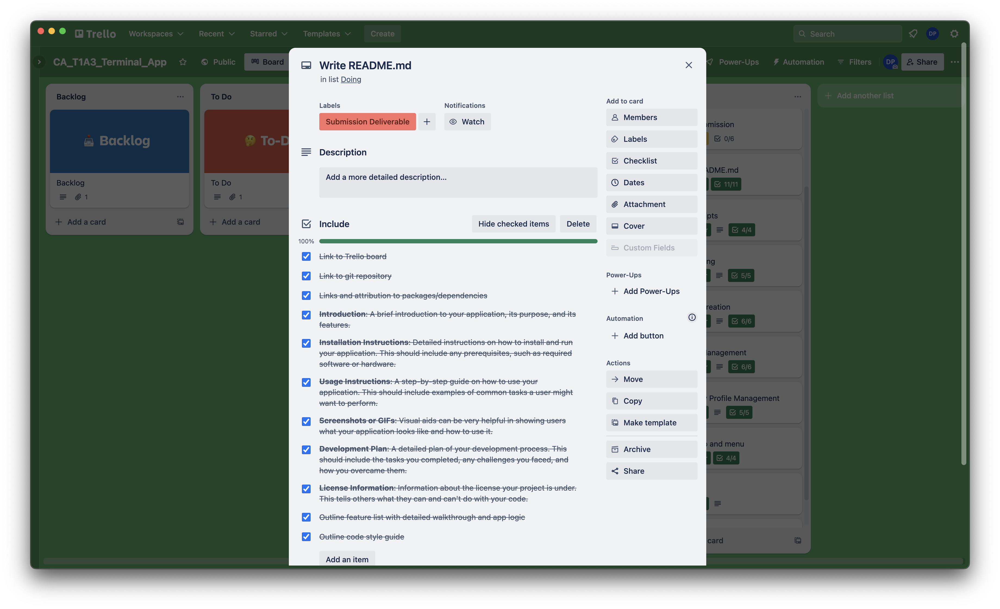
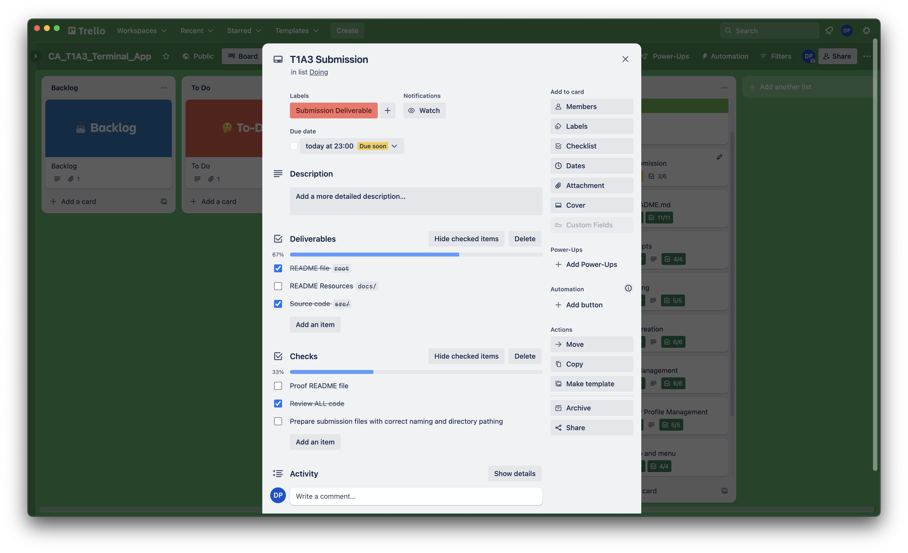


---

I have also broken the trello board down into a list below:

#### Setup the project structure
- Create the necessary directories and files for the application.

#### Terminal Management
- Research how to resize and clear terminal windows in different operating systems.
- Implement the `resize_terminal` function: This function will resize the terminal window to a specific size to ensure that the application's user interface displays correctly.
- Implement the `clear_terminal` function: This function will clear the terminal window. It will be used to clear the screen between different screens of the application.
- Test the `resize_terminal` and `clear_terminal` functions to ensure they work correctly.
- Document the `resize_terminal` and `clear_terminal` functions in the code.

#### Onboarding
- Design the onboarding process and the information to collect from the user.
- Implement the `check_onboarding` function: This function will check if the onboarding process has been completed. It will look for a `company_profile.csv` file in the `src/data` directory. If the file exists, it means onboarding has been completed; if not, the onboarding process is initiated.
- Implement the `onboarding` function: This function will guide the user through the onboarding process. It will ask the user to enter their company's details and save them to a `company_profile.csv` file in the `src/data` directory.
- Test the onboarding process to ensure it works correctly.
- Document the onboarding process in the code.

#### Invoice Creation
- Design the invoice creation process and the information to collect from the user.
- Implement the `collect_input_invoice` function: This function will collect the necessary information from the user to create a new invoice. It will ask the user to enter the customer's details, the invoice number, the due date, and the items to be invoiced.
- Implement the `create_new_invoice` function: This function will create a new invoice. It will use the `jinja2` library to generate an HTML invoice from a template, the `xhtml2pdf` library to convert the HTML invoice to a PDF, and the `csv` module to save the invoice information to a CSV file.
- Implement the `create_html_invoice` function: This function will generate an HTML invoice from a template. It will use the `jinja2` library to fill a template with the invoice information.
- Implement the `save_html_to_file` function: This function will save the HTML content to a file. It will be used to save the HTML invoice to a file before it is converted to a PDF.
- Test the invoice creation process to ensure it works correctly.
- Document the invoice creation process in the code.

#### Invoice Management
- Design the invoice management process, including viewing, re-exporting, and deleting invoices.
- Implement the `view_past_invoices` function: This function will display a list of past invoices. It will read the past invoices from the `past_invoices.csv` file and display them to the user.
- Implement the `re_export_to_pdf` function: This function will re-export an invoice to a PDF. It will be used when the user chooses to re-export an invoice from the list of past invoices.
- Implement the `delete_invoice_record` function: This function will delete an invoice record. It will be used when the user chooses to delete an invoice from the list of past invoices.
- Test the invoice management process to ensure it works correctly.
- Document the invoice management process in the code.

#### Company Profile Management
- Design the company profile management process, including viewing and updating the company profile.
- Implement the `view_and_update_company_profile` function: This function will display the company profile and allow the user to update it. It will read the company profile from the `company_profile.csv` file, display it to the user, and allow the user to update it.
- Create a user-friendly interface for viewing and updating the company profile.
- Test the company profile management process to ensure it works correctly. This includes testing the function with different inputs and checking the `company_profile.csv` file to ensure the updates are saved correctly.
- Document the company profile management process in the code. This includes adding comments to the `view_and_update_company_profile` function and updating the README file to explain how to use this feature.

#### Application Loop
- Implement the `app` function: This function will be the main loop of the application. It will display the main menu to the user and handle the user's choices. It will call the appropriate functions based on the user's input.
- Ensure that the application loop handles invalid inputs gracefully and prompts the user again when an invalid input is entered.
- Test the application loop to ensure it works correctly. This includes testing it with different inputs and checking that it calls the correct functions.

#### Create README Documentation: 

- **Introduction**: A brief introduction to your application, its purpose, and its features.

- **Installation Instructions**: Detailed instructions on how to install and run your application. This should include any prerequisites, such as required software or hardware.

- **Usage Instructions**: A step-by-step guide on how to use your application. This should include examples of common tasks a user might want to perform.

- **Screenshots or GIFs**: Visual aids can be very helpful in showing users what your application looks like and how to use it.

- **Development Plan**: A detailed plan of your development process. This should include the tasks you completed, any challenges you faced, and how you overcame them.

- **License Information**: Information about the license your project is under. This tells others what they can and can't do with your code.

<br>

## License
[MIT](docs/LICENSE)